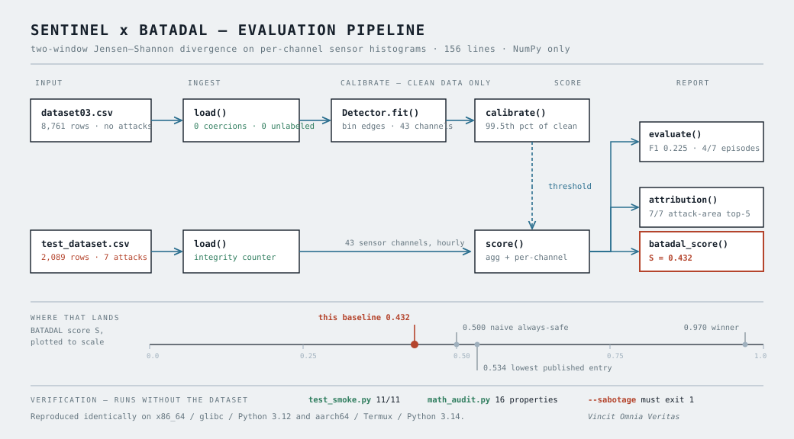
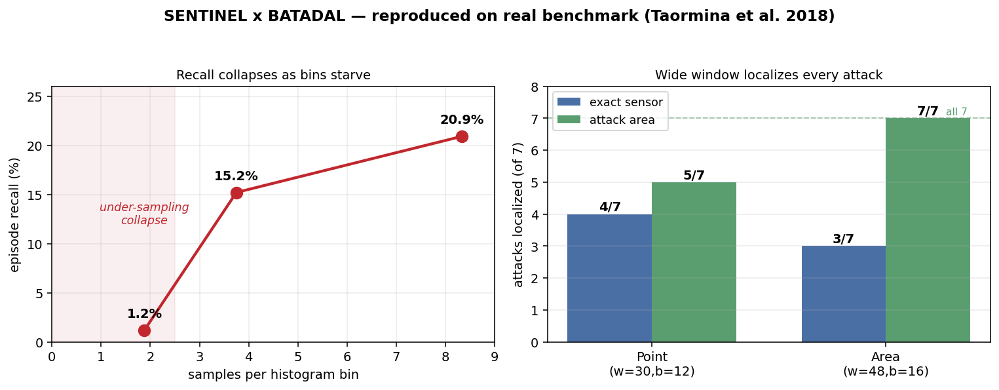
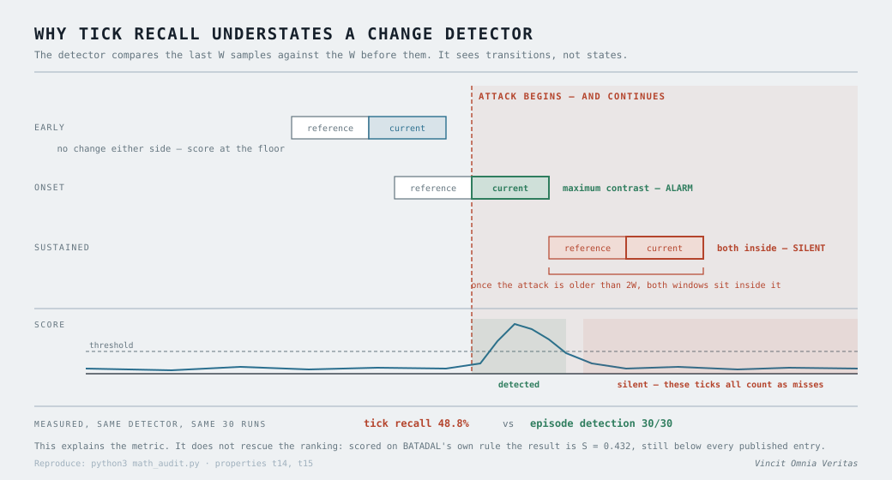

# SENTINEL x BATADAL — Public Benchmark Validation
*Vincit Omnia Veritas — Truth Conquers All.*

A minimal reference implementation of SENTINEL's detection method — two-window
Jensen-Shannon divergence on per-channel sensor histograms — scored against the
public BATADAL water-distribution attack benchmark (Taormina et al. 2018).
156 lines, NumPy only, no cloud, no configuration.

**Not** the proprietary SENTINEL v12: this is a faithful reference
implementation plus evaluation harness. `class Detector` is the seam where the
production detector drops in. Thresholds auto-calibrate from clean data
(99.5th percentile) — no proprietary constants anywhere.

## Headline result, on BATADAL's own metric

The competition does not rank on F1. Per the official rules (§3.3–3.4):

    S = γ·S_TTD + (1−γ)·S_CM,  γ = 0.5
    S_TTD = 1 − mean(TTD_i / Δt_i)      time-to-detection
    S_CM  = (TPR + TNR) / 2             balanced accuracy, not F1

| Profile | S_TTD | TPR | TNR | S_CM | **S** | F1 | Episodes |
|---|---:|---:|---:|---:|---:|---:|---:|
| Conservative (w=100,b=12) | 0.216 | 0.209 | 0.875 | 0.542 | **0.379** | 0.251 | 2/7 |
| Balanced (w=60,b=16) | 0.314 | 0.152 | 0.947 | 0.550 | **0.432** | 0.225 | 4/7 |
| Aggressive (w=30,b=16) | 0.202 | 0.012 | 0.987 | 0.500 | **0.351** | 0.023 | 3/7 |

**S = 0.432 at best. That is below every published BATADAL entry** — the
lowest-ranked, Aghashahi, scored 0.534; the winner, Housh & Ohar, 0.970. An
`S_CM` of 0.550 is barely above the 0.500 a naive always-safe predictor earns.

Read this repository as a reproducible baseline, not as a working detector.
Reproduce it with `python3 batadal_score.py ./batadal`.

**The best profile changes with the metric.** F1 ranks Conservative highest;
S ranks Balanced highest and demotes Conservative. Shipping on the F1 headline
would have shipped the wrong configuration. That is the argument for scoring
against the benchmark's own rule rather than a convenient one.

**Time-to-detection is the strongest dimension.** When it fires, it is fast —
12 h into a 31 h attack, 21 h into 65 h, 25 h into 100 h. It detects 4 of 7 and
misses attacks 4, 6 and 7 outright.

## Detection results (test set: 2,089 records, 7 attacks)

*Left panel y-axis is **tick recall** (attack ticks flagged / total attack ticks); the axis label reads "episode recall" and is wrong — it will be corrected when the figure is regenerated. Episode counts are in the table below.*

| Profile | samples/bin | Episodes | Tick recall | Precision | F1 |
|---|---|---|---|---|---|
| Conservative (w=100,b=12) | 8.33 | 2/7 | 20.9% | 31.5% | 0.251 |
| Balanced (w=60,b=16) | 3.75 | 4/7 | 15.2% | 42.8% | 0.225 |
| Aggressive (w=30,b=16) | 1.88 | 3/7 | 1.2% | 19.2% | 0.023 |

**Definitions.** *Episodes* = attack episodes with at least one flagged tick
(of 7). *Tick recall* = TP/(TP+FN) over labeled attack ticks. These measure
different things, so a profile can detect more episodes at lower tick recall.

The histogram under-sampling failure mode is real and reproduced on external
labeled data: at 1.88 samples/bin, recall collapses to ~1%.

**Tick recall understates any two-window detector by construction.** Once a
sustained attack is older than 2W ticks, both windows sit inside the attacked
regime, the distributions match again, and the score returns to the noise
floor. The detector sees transitions, not states — so tick recall counts as
misses the ticks it is mathematically unable to alarm on. Measured on
synthetic runs in `math_audit.py`: 48.8% tick recall against 30/30 episode
detection, same detector, same data. This explains the metric but does not
rescue the ranking — S = 0.432 is measured on BATADAL's own rule and is still
below the field.

## Attribution results (vs published per-attack ground truth)

| Config | Exact target in top-5 | Attack-area in top-5 |
|---|---|---|
| Point (w=30,b=12) | 4/7 | 5/7 |
| Area (w=48,b=16) | 3/7 | **7/7** |

Two honest operating points: the wide window localizes every attack to a
physically-relevant channel; the tight window pins the exact sensor more often.
Attacks 9/12 replay L_T2 to SCADA, so coupled-channel localization is the
correct outcome there. Caveats: reference detector (a baseline the tuned v12
should beat); exact-sensor localization at hourly granularity is inherently
limited — published literature reports the same constraint.

## Verification

| What | Command | Expected |
|---|---|---|
| Self-tests, no data needed | `python3 test_smoke.py` | 11/11, exit 0 |
| Prove the suite can fail | `python3 test_smoke.py --sabotage` | 0/2, exit 1 |
| Mathematical audit | `python3 math_audit.py` | 16 properties, 3 flaws |
| Official score | `python3 batadal_score.py ./batadal` | S = 0.432 (Balanced) |

`math_audit.py` checks the divergence against the theorems it must satisfy.
All six hold, including that √JSD obeys the triangle inequality
(Endres & Schindelin 2003) — zero violations in 20,000 random triples. The
three "flaws" it reports are documented structural limits, not regressions;
they are described in `REPRODUCED.md`.

Reproduced identically on x86_64/glibc/Python 3.12 and aarch64/Termux/Python
3.14, to four decimal places.

**Data integrity.** `load()` reports every unparseable cell and every
`ATT_FLAG = -999` row rather than silently coercing it to zero. On the test
data that count is zero, so the numbers above are not corrupted by it. Note
`dataset04.csv` carries 3,958 unlabeled (`-999`) rows that older code scored as
confirmed-normal; see `REPRODUCED.md`.

## Second experiment: vera_batadal.py (certificate-based, NOT scored on S)

A different method on the same data: ridge dynamics plus a split-conformal
certificate, flagging attacks as certificate breaches. Predictions were
registered before the first run; two of four failed and are kept.

    P0 anti-vacuity  PASS  attack breach 54.5% vs clean 30.3%
    P1 coverage      FAIL  0.697 vs nominal 0.90 (kept)
    P2 separation    FAIL  1.8x vs registered 3x (kept)
    P3 tick F1       0.437 vs this repo's 0.251

**That F1 is not comparable to the table above, and does not rank this method
against anything.** This repository argues that F1 is the wrong metric for
BATADAL; that argument applies here too. vera_batadal.py has never been scored
on S, has no episode-level detection, and has no TTD. Until it runs through
`batadal_score.py` it is an experiment, not a result on the benchmark.

The P1 failure is the more interesting number: coverage collapsed because the
clean calibration year genuinely differs from the test year. The certificate
did not break - it reported drift.

## Reproduce

    pip install -r requirements.txt --break-system-packages
    bash fetch_batadal.sh
    python3 sentinel_batadal.py ./batadal
    python3 batadal_score.py ./batadal

`fetch_batadal.sh` verifies that every file it downloads actually carries an
`ATT_FLAG` column and exits non-zero if not — the test set published on
batadal.net is the original unlabeled competition release.

Data © its authors, not redistributed here. `attacks.csv` transcribes the
organisers' published attack tables for scoring; cite Taormina et al. 2018,
*J. Water Resour. Plann. Manage.* 144(8), and the competition rules
(Taormina, Galelli, Tippenhauer, Ostfeld, Salomons, 9 Sep 2016,
<http://www.batadal.net>).

## Reproduced it, or got different numbers?

Open an issue with your Python and NumPy versions, platform, the five numbers,
the `data integrity` line, and your `batadal_score.py` output. Mismatches are
more useful than matches and get logged in `REPRODUCED.md`.

## License
MIT — free for anyone to use, including commercially. The only condition is
that the copyright notice stays with the code. See LICENSE.

**Chad Edward Holland** (@holland202) · Sovereign Evolution · Oklahoma, USA
